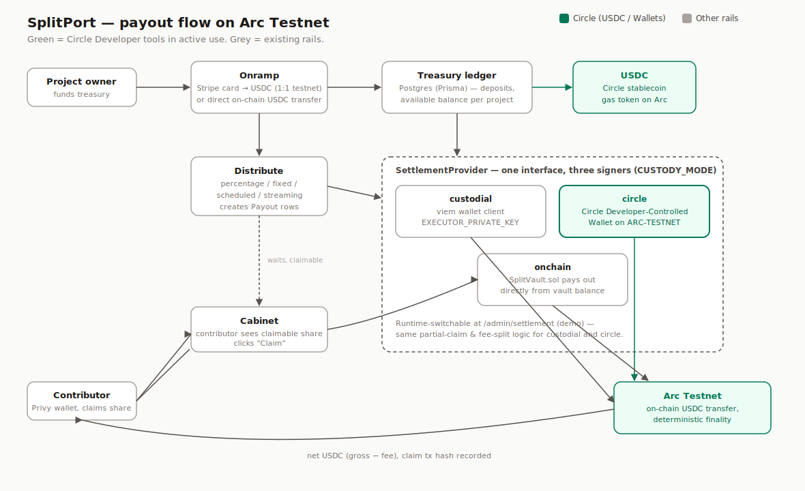

# SplitPort

Split-payout platform for global teams, paid in USDC on **Arc Testnet** (Circle).
Fund a shared treasury by card or crypto, set each person's share, and distribute —
by percentage, fixed salary, schedule, or a live stream. Recipients need only a
Google login; gas is paid by the executor in USDC, so no crypto skills are required.

**Live:** https://splitport.vercel.app



## How it works

1. **Fund** — top up a project treasury via Stripe (card, testnet 1:1) or an on-chain USDC transfer.
2. **Split** — add contributors by wallet address or invite link; set shares (%, fixed, scheduled, streaming).
3. **Distribute** — the executor settles payouts on-chain; recipients claim to their embedded wallet, fee deducted at claim.

## Stack

- **Frontend:** Next.js (App Router), Tailwind, TypeScript — `frontend/`
- **Auth & wallets:** Privy (embedded wallets, Google/email/wallet login)
- **Chain:** Arc Testnet, USDC settlement; `SplitVault.sol` (Solidity, Hardhat, 19 tests) — `contracts/`
- **Onramp:** Stripe (card → USDC, testnet)
- **DB:** Prisma / Postgres (distribution accounting)
- **Circle:** USDC (settlement rail) + Developer-Controlled Wallets (executor signer) + User-Controlled Wallets (recipients) + Bridge Kit + Unified Balance Kit — see below

## Circle integration

SplitPort settles every payout in **USDC on Arc Testnet**. The executor that
signs those payouts can run on either of two interchangeable signers, selected
by `CUSTODY_MODE` and switchable live at `/admin/settlement`:

| Mode | Signer | Where |
|---|---|---|
| `custodial` (default) | viem wallet client, `EXECUTOR_PRIVATE_KEY` | [`lib/executor.ts`](frontend/lib/executor.ts), [`lib/settlement/custodial.ts`](frontend/lib/settlement/custodial.ts) |
| `circle` | **Circle Developer-Controlled Wallet** (`@circle-fin/developer-controlled-wallets`), wallet created on `ARC-TESTNET` | [`lib/circleWallet.ts`](frontend/lib/circleWallet.ts), [`lib/settlement/circleSettlement.ts`](frontend/lib/settlement/circleSettlement.ts) |
| `onchain` | on-chain `SplitVault.sol`, vault pays out directly | [`lib/settlement/vault.ts`](frontend/lib/settlement/vault.ts) |

Both `custodial` and `circle` share the same Postgres-tracked payout/stream
ledger and partial-claim logic (`lib/settlement/index.ts` factory) — only the
signer that actually moves USDC on Arc differs. This means every claim, fee
deduction, and partial-claim path already proven in production also works
identically when Circle Wallets sign the transfer.

**Setup:**

1. Create a [Circle Developer account](https://console.circle.com/signup) and an API key.
2. Generate + register an entity secret with `@circle-fin/developer-controlled-wallets`
   (`generateEntitySecret()` / `registerEntitySecretCiphertext()`), and create a
   wallet set + wallet on blockchain `ARC-TESTNET`.
3. Set in `frontend/.env.local`:
   ```
   CIRCLE_API_KEY=...
   CIRCLE_ENTITY_SECRET=...
   CIRCLE_WALLET_SET_ID=...
   CIRCLE_WALLET_ID=...
   CIRCLE_WALLET_ADDRESS=0x...
   ADMIN_TOKEN=...            # gates /admin/settlement
   ```
4. Fund the Circle wallet address with testnet USDC (same faucet/transfer path
   used for the executor wallet).
5. Set `CUSTODY_MODE=circle`, or leave it as `custodial` and flip the signer
   live from `/admin/settlement` (paste `ADMIN_TOKEN`, click "Use Circle Wallet").

### Beyond Arc: User-Controlled Wallets, Bridge Kit, Unified Balance Kit

Three more Circle products are wired in, each additive to an existing flow
rather than replacing it:

- **Circle User-Controlled Wallets** — a contributor can generate a
  PIN-secured wallet on `ARC-TESTNET` from their cabinet as an alternate
  payout destination, alongside their Privy embedded wallet. Auth stays on
  the Privy wallet; only the claim's transfer target changes.
  [`lib/circleUserWallet.ts`](frontend/lib/circleUserWallet.ts),
  [`components/CircleWalletCard.tsx`](frontend/components/CircleWalletCard.tsx).
- **Bridge Kit (CCTPv2)** — a contributor can claim their payout bridged
  directly to Base Sepolia instead of the usual same-chain Arc transfer,
  picked from a dropdown in the cabinet.
  [`lib/bridgeKit.ts`](frontend/lib/bridgeKit.ts),
  wired into [`lib/settlement/custodial.ts`](frontend/lib/settlement/custodial.ts).
- **Unified Balance Kit (Gateway v1)** — the treasury page can be topped up
  from USDC already held on Base Sepolia: one deposit into Gateway, one
  spend that mints directly on Arc, no manual bridging step.
  [`lib/unifiedBalanceKit.ts`](frontend/lib/unifiedBalanceKit.ts),
  [`components/UnifiedBalanceTopUpCard.tsx`](frontend/components/UnifiedBalanceTopUpCard.tsx).

All three were exercised end-to-end on testnet with real fund movement, not
just unit-level calls — see commit history for tx hashes on Arc Testnet and
Base Sepolia.

### Circle Product Feedback

**Why we chose these products:** the challenge is judged on effective use of
Circle's Developer tools, and our existing settlement layer already had a
signer abstraction (`SettlementProvider`) — Developer-Controlled Wallets was
the product that dropped in without touching the recipient-facing flow, letting
us add real Circle infrastructure instead of a conceptual integration.

**What worked well:**
- The SDK's `ARC-TESTNET` support was already there and undocumented-but-discoverable
  — creating a wallet with `blockchains: ["ARC-TESTNET"]` just worked.
- `getTransaction({ waitForTxHash: true })` removed the need to hand-roll a
  polling loop for transaction confirmation.
- `estimateTransferFee` returns a `networkFee` already denominated in the
  gas-token's decimal units, which mapped cleanly onto our existing fee-deduction
  math (Arc uses USDC as gas, so no unit conversion was needed).

**What could be improved:**
- The `createTransaction`/`estimateTransferFee` input types are a discriminated
  union between `walletId` (`+tokenId`) and `walletAddress`+`blockchain`
  (`+tokenAddress`) — mixing `walletId` with `tokenAddress` compiles-looking but
  fails at the type level with a confusing error. A single "give me a wallet
  and a token, in whatever form" input would remove that trap.
- No SDK helper to look up a token's `tokenId` from its `tokenAddress` +
  `blockchain` for the `walletId` code path — we had to read it once from a
  `getWalletTokenBalance` response and hardcode it.
- Registering an entity secret writes a `recovery_file_*.dat` straight to the
  current working directory rather than returning it as data — easy to
  accidentally leave inside a git-tracked project folder.
- Unified Balance Kit's `spend` requires the source balance to cover
  `amount + fees`, but the amount that ends up minted on the destination
  chain is exactly `amount` — the error message ("Available: 0.5, required:
  0.51") doesn't make that distinction, so it initially read like a rounding
  bug rather than "deposit slightly more than you intend to spend."
- Gateway deposits take real wall-clock time to reach finality (~10 minutes
  observed on Base Sepolia) before `spend` can use them — expected given
  source-chain finality requirements, but worth flagging up front in the
  Quick Start rather than discovering it via a `BALANCE_INSUFFICIENT_TOKEN`
  error on the first attempt.
- The default public Arc Testnet RPC (`rpc.testnet.arc.network`) rate-limits
  under moderate load; we had to add `arc-testnet.drpc.org` as a fallback
  transport for both the executor and the Bridge/Unified Balance Kit
  adapters to get reliable reads.

**Recommendations:** publish the list of currently-supported `blockchains`
values (including `ARC-TESTNET`) directly on the Wallets quickstart page, and
add a `getTokenId(tokenAddress, blockchain)` convenience method so `walletId`-based
transfers don't require a manual balance lookup first.

## Run locally

```bash
# Frontend
cd frontend
npm install
cp .env.example .env.local   # set Privy, Stripe, DATABASE_URL, EXECUTOR_PRIVATE_KEY, etc.
npm run dev

# Contracts
cd contracts
npm install
npx hardhat test
```

See [PROJECT_CONTEXT.md](PROJECT_CONTEXT.md) for architecture and
[NONCUSTODIAL.md](NONCUSTODIAL.md) for the on-chain custody roadmap.
